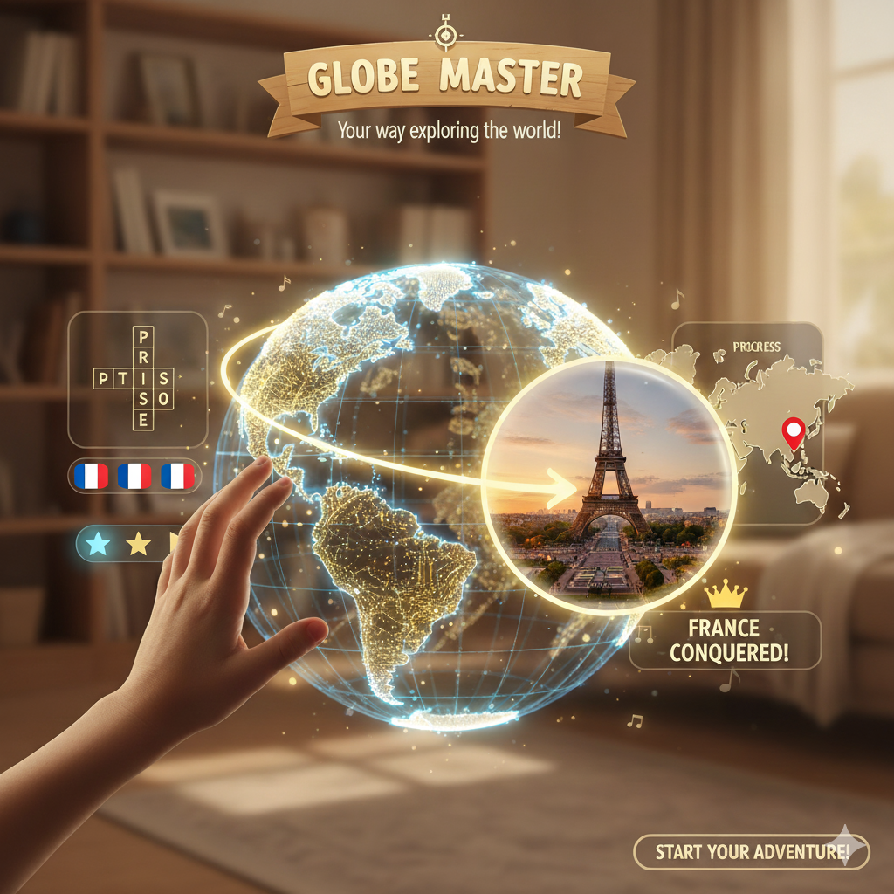
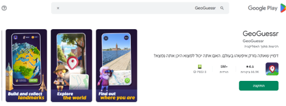
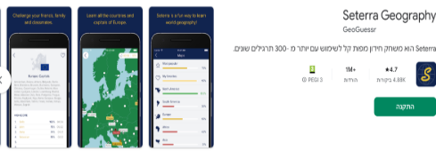
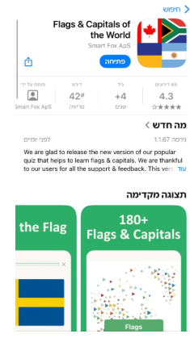

<h1>🌍 גלובוס מאסטר – Globe Master</h1>

<strong>סלוגן:</strong> "סובב את העולם, גלה מדינות, וכבוש את הגלובוס!"

<!-- תמונה ממורכזת -->

<ul>
  <li><strong>מהות המשחק:</strong> משחק חווייתי־לימודי המשלב גיאוגרפיה, זריזות וחשיבה מהירה. מטרת השחקן היא לכבוש את כל מדינות העולם באמצעות זיהוי <em>דגל</em> או <em>אתר תיירותי</em> במהירות ובדיוק. בעזרת <em>Zoom In</em> מחלל־חוץ השחקן בוחר יבשת ומתקדם מדינה אחר מדינה בין היבשות.</li>
  <li><strong>קצב וניקוד:</strong> ככל שהזיהוי מהיר יותר – כך הניקוד גבוה יותר.</li>
  <li><strong>מצבי משחק:</strong> שחקן יחיד או תחרות אונליין מול שחקנים אחרים במכשירים ניידים.</li>
</ul>

  

<h2> שחקנים וקהל יעד</h2>
<ul>
  <li>ילדים מגיל 10 ומעלה, ומבוגרים עם קשיים בתפקודים מנטליים (קשב, תפיסה, חשיבה).</li>
  <li>המשחק נותן מענה לקושי בעבודה רמדיאלית ומקדמת מרכיבים כגון:
    <ul>
      <li>תפיסה (דמות־ורקע)</li>
      <li>התמצאות (מיקום בעולם וביחס ליבשות)</li>
      <li>זיהוי (אתרים/דגלים מוכרים)</li>
      <li>שליפה יעילה מזיכרון לטווח ארוך</li>
      <li>קשב ממוקד במשימה</li>
    </ul>
  </li>
  <li>אין צורך בניסיון קודם – זיקה לגיאוגרפיה/תיירות מספיקה.</li>
  <li>תחרותיות: לוח מובילים שבועי (מי זיהה הכי הרבה דגלים), תוכנית התקדמות אישית לכיבוש יבשות, ומצב מולטי־פלייר "בוחן דגלים" מהיר.</li>
</ul>

<h2> יעדים</h2>
<ul>
  <li><strong>יעד על:</strong> כיבוש כל העולם – 193 מדינות חברות באו״ם – בזיהוי דגלים/אתרים.</li>
  <li><strong>יעדי ביניים:</strong> איסוף מטבעות לרכישת רמזים; צבירת זיהויים לפתיחת יבשות חדשות.</li>
  <li><strong>שלבים וקושי:</strong> שלבים מוגדרים כחלקי־יבשות/יבשות שלמות, החל מיבשת הבית ובהדרגת קושי.</li>
  <li><strong>ויזואליזציה:</strong> יעדים כבושים = ירוק; יעדים זמינים = אדום; נעולים = אפור (ייפתחו בהמשך).</li>
</ul>

<h2> תהליכים</h2>
<ul>
  <li><strong>תהליך התחלה:</strong> 30 שניות פתיחה עם גלובוס מסתובב, מוזיקה קצבית וכפתור <em>Start Exploring</em>. זיהוי המדינה שבה נמצא השחקן כשלב לימוד ראשוני.</li>
  <li><strong>תהליך עיקרי:</strong> סיבוב הגלובוס במגע ובחירת יבשת פתוחה; בתוך היבשת בחירת מדינה – יוצג דגל/אתר תיירותי, והשחקן נדרש לבחור את שמה. פעם בכל שעה עגולה ניתן להפעיל <em>גלגל מזל</em> למטבעות/XP. רמזים אפשריים: הוספת אותיות, תמונת אתר תיירותי, מאכל עממי. כל רמז עולה 5 שניות מזמן השאלה. תשובה נכונה – המדינה נצבעת בצבעי הדגל.</li>
  <li><strong>תהליך תחרותי (משני):</strong> דו־קרב מהיר בין שני שחקנים על אותו דגל; מי שמקליד ראשון את המדינה מנצח. פרסים: מטבעות ו־XP לפתיחת יבשות. (ללא רמזים במצב זה.)</li>
  <li><strong>אלמנט זמן:</strong> ב־5 השניות האחרונות – הילה אדומה וקול שעון להגברת לחץ חיובי ותרגול קשב.</li>
  <li><strong>תהליך סיום:</strong> סיום כאשר נכבשו כל המדינות. מדריך אינטראקטיבי (חיצים/בועות הסבר) מופיע רק בכניסה הראשונה ובמדינה הראשונה; הדרכה נפרדת גם למצב התחרותי.</li>
</ul>

<h2> חוקים</h2>
<ul>
  <li>מותרות 2 טעויות; בטעות שלישית – ניתן לנסות שוב את אותה מדינה רק אחרי 10 דקות.</li>
  <li>מטבעות לזכייה נקבעים לפי מספר ניסיונות כושלים וזמן הזיהוי.</li>
  <li>כניסה לתחרות: 50 מטבעות לשחקן; זכייה: 75 מטבעות.</li>
  <li>רצף של 3 זיהויים ללא טעות מזכה <strong>בבונוס ניקוד כפול</strong> בדגל הבא ל־24 שעות.</li>
  <li>מערכת הסברים דינמית מדריכה את השחקן בצעדיו הראשונים.</li>
</ul>

<h2> משאבים</h2>
<ul>
  <li><strong>מטבעות:</strong> לרכישת רמזים ולכניסה לתחרויות. קנס 25 מטבעות על 3 טעויות. אחרי 3 זיהויים מוצלחים – הזדמנות לניקוד כפול בדגל הבא.</li>
  <li><strong>XP:</strong> לפתיחת שלבים ויבשות חדשות.</li>
  <li><strong>זמן:</strong> משאב משני – שימוש ברמז גורע 5 שניות.</li>
  <li><strong>ניראות משאבים:</strong> מד־הזמן מוצג בעת חידה; סך המטבעות מוצג למעלה־שמאל; עם זכייה/אובדן מושמע צליל ומספר המטבעות מתעדכן.</li>
</ul>

<h2> עימותים</h2>
<ul>
  <li><strong>שחקן מול מערכת:</strong> מדינות קשות יותר בהתקדמות.</li>
  <li><strong>מחיר הרמזים:</strong> הקרבת מטבעות/זמן הכרחיים להתקדמות.</li>
  <li><strong>שחקן מול עצמו:</strong> החלטות – להיכנס לתחרות ב־50 מטבעות? להשתמש ברמזים? לנהל טעויות לקראת בונוס כפול?</li>
  <li><strong>שחקן מול שחקן:</strong> ראש בראש בתחרות; וכן לוח מובילים שבועי.</li>
</ul>

<h2> גבולות, ניווט ועקרונות</h2>
<ul>
  <li><strong>גבולות העולם:</strong> מסך דו־ממדי עם גלובוס; זום־אין/זום־אאוט וסיבוב בלבד.</li>
  <li><strong>משמעות:</strong> כל מדינה מקושרת לדגל/יעד לזיהוי באותו סבב.</li>
  <li><strong>ניידות:</strong> מגע במסך – גרירה סביב הגלובוס; צביטה/פתיחה לזום.</li>
  <li><strong>התמצאות:</strong> נעול = אפור; לא נכבש = אדום; נכבש = ירוק.</li>
  <li><strong>עניין:</strong> אתגרים מתקדמים ואתרים תיירותיים אמיתיים.</li>
  <li><strong>הכוונה:</strong> מערכת רמזים דינמית ומדריך אינטראקטיבי בתחילת הדרך.</li>
</ul>

<h2> תוצאות</h2>
<ul>
  <li>זיהוי דגל: +10 מטבעות; כיבוש יבשת שלמה: +100 מטבעות.</li>
  <li>תחרות: השקעה 50 מטבעות; זכייה 75 מטבעות.</li>
  <li>ההתקדמות תלויה בידע ובמיומנות; דגלים שזוהו בתחרות מסייעים גם במשחק העיקרי.</li>
  <li>במיין־גיים – חוויה אישית עם לוח מובילים שבועי.</li>
  <li>בסיום המשחק השחקן יכבוש את הגלובוס כחלק מתהליך אישי, במטרה לעודד את המטופל להמשיך ביעדים.</li>
</ul>

<h2> סקירת משחקים קיימים</h2>
<ul>
  

  <li>
    <strong>GeoGuessr</strong> – זיהוי מקומות תיירותיים מרכזיים בעולם; נכנסים לרחוב בסגנון Google Earth וממקמים נעץ על המפה. 
    חסרים: כניסה מהחלל, מנגנון "כבישה" של יעדים, תמונות יעד מעוררות עניין לכל מדינה, ורכיב תחרות אונליין כפי שמוגדר כאן. 
    <a href="https://play.google.com/store/search?q=Geoguesser&c=apps">קישור</a>
  

      
    

  </li>
  <li>
    <strong>Seterra Geography</strong> – משחק לימוד מדינות וערים במפה דו־ממדית. 
    חסר: רכיב תלת־ממדי, פיצ'ר תחרותי, ומרכיב תיירותי חזותי. 
    <a href="https://play.google.com/store/search?q=Seterra%20geography&c=apps">קישור</a>
    

      
    

  </li>
  <li>
    <strong>Flags &amp; Capitals of the World</strong> – טריוויה של דגלים וערי בירה, מרמת מוכרים ועד קשים. 
    חסר: חוויית כבישה, תהליך רציף לכיבוש הגלובוס, תמונות יעדים ולמידה חזותית/התמצאות כפי שנדרש כאן. 
    <a href="https://apps.apple.com/il/app/flags-capitals-of-the-world/id1539501646?l=he">קישור</a>
    

      
    

  </li>
</ul>

<h2> ייחודיות המשחק</h2>

מבין הרכיבים הרשמיים שציינו לעיל, המרכיב העיקרי שמייחד את המשחק שלנו הוא 
<strong>המצב התחרותי</strong> – המאפשר לשחקנים לצבור מטבעות וליצור אינטראקציות חברתיות אמיתיות סביב תוכן המשחק.  
כמו כן, קיים מרכיב נוסף שמייחד את המשחק שלנו והוא 
<strong>האינטראקציה התלת־ממדית עם הגלובוס</strong>, 
המעניקה לשחקן תחושת הישג אמיתית ומוחשית עם כל כיבוש של מדינה או יבשת חדשה.  
בנוסף, ניתן לספק <strong>תוצאה אבחונית</strong> כאשר המטפל צופה במטופל המשחק, 
ומסוגל להסיק ממנה על תפקודים קוגניטיביים, רמת קשב, גמישות מחשבתית ואסטרטגיות פעולה, 
ובכך לקבוע את המשך תהליך האבחון והטיפול.  
התוצאה לחיי היומיום היא <strong>שיפור ביכולת הקשב המתמשך</strong> לאורך זמן, 
תרגול של אסטרטגיות לזיהוי וחשיבה, 
וכן חיזוק מיומנויות של <strong>תפיסה חזותית</strong> – כגון הבחנה בין דמות לרקע והתמצאות במרחב.

